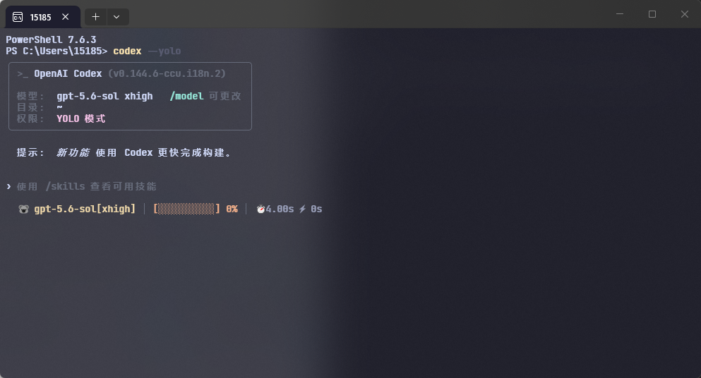
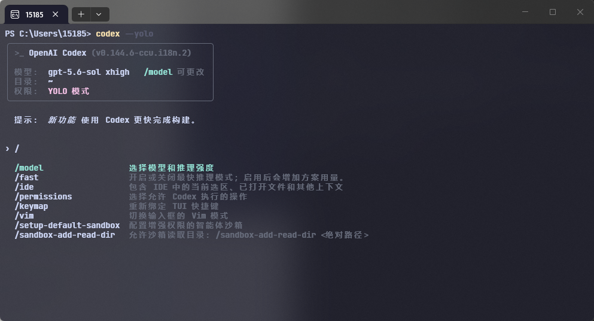
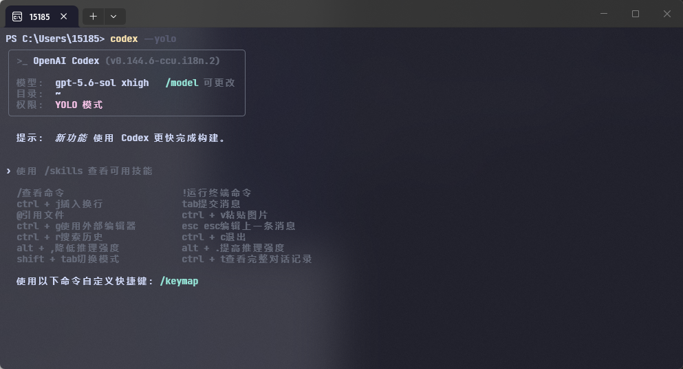
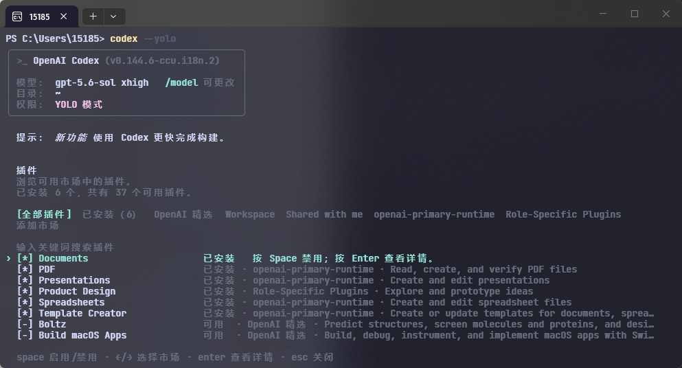
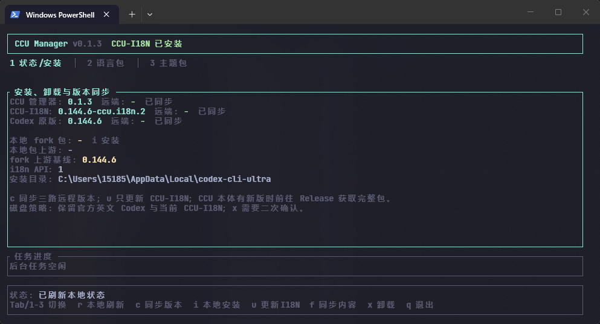

# Codex-Cli-Ultra

[中文](README.md) · **English**

[](https://github.com/Cec1c/codex-cli-ultra/releases/latest)


[](LICENSE)

Codex-Cli-Ultra (CCU) provides external FTL language packs, cross-platform installation management, and optional interface extensions for Codex CLI. Simplified Chinese is the current reference implementation.

[Latest Release](https://github.com/Cec1c/codex-cli-ultra/releases/latest) · [Contributing](CONTRIBUTING.md) · [Codex i18n fork](https://github.com/Cec1c/codex)

## Project goals

- **Localization:** provide a stable i18n interface so each locale can be maintained as an independent FTL package. Missing or invalid translations fall back to built-in English per message.
- **Interface extensions:** explore optional status-line, theme, and terminal UI configuration without changing the base workflow.
- **Version management:** manage installation, updates, removal, and status across official Codex, the CCU-I18N fork, and CCU itself.

## Demo

The current screenshots use the Simplified Chinese language pack. Other locales can be built from the [English template](templates/languages/messages.en-US.ftl); see [CONTRIBUTING.md](CONTRIBUTING.md).

The terminal background, font, and colors are provided by a separate terminal configuration. CCU provides the localized Codex interface and the optional status line shown in the screenshots.

<table>
  <tr>
    <td width="50%"><strong>Home</strong><br></td>
    <td width="50%"><strong>Slash commands</strong><br></td>
  </tr>
  <tr>
    <td width="50%"><strong>Help</strong><br></td>
    <td width="50%"><strong>Secondary screen</strong><br></td>
  </tr>
</table>

## Installation and removal

### Requirements

- Windows x64, Linux x64/ARM64, or macOS Intel/Apple Silicon
- Node.js 22.19.0 or newer
- Official Codex installed through npm
- PowerShell 7 on Windows; Bash on Linux and macOS

```powershell
npm install -g @openai/codex
```

### Release installation (recommended)

1. Download the ZIP for your platform and its `.sha256` from [Releases](https://github.com/Cec1c/codex-cli-ultra/releases/latest).
2. Verify the SHA256 and extract the ZIP.
3. Run `install.cmd` on Windows or `./install.sh` on Linux/macOS.
4. Open a new terminal and verify the installation:

```powershell
codex --version
codex --i18n-self-check
codex --yolo
```

The Release ZIP includes a fork binary verified against its manifest, file size, and SHA256.

| System | Release suffix | Installer |
| --- | --- | --- |
| Windows x64 | `windows-x64.zip` | `install.cmd` |
| Linux x64 | `linux-x64.zip` | `./install.sh` |
| Linux ARM64 | `linux-arm64.zip` | `./install.sh` |
| macOS Intel | `macos-x64.zip` | `./install.sh` |
| macOS Apple Silicon | `macos-arm64.zip` | `./install.sh` |

Linux/macOS example:

```bash
sha256sum -c codex-cli-ultra-v*-linux-x64.zip.sha256  # use shasum -a 256 -c on macOS
unzip codex-cli-ultra-v*-linux-x64.zip
cd codex-cli-ultra-v*-linux-x64
./install.sh
source ~/.bashrc  # use source ~/.zshrc for zsh
```

The multi-platform Release pipeline is being landed. If the latest Release does not yet contain your Unix asset, use the source installation below rather than another platform's binary.

To remove CCU and return to the official English build:

```powershell
codex-ultra uninstall
# or run uninstall.cmd / ./uninstall.sh from the Release package
```

### Source installation

A source installation also requires a Rust toolchain:

```powershell
git clone https://github.com/Cec1c/codex-cli-ultra.git
cd codex-cli-ultra
npm ci
.\install.ps1
```

Linux/macOS:

```bash
git clone https://github.com/Cec1c/codex-cli-ultra.git
cd codex-cli-ultra
npm ci
./install.sh
```

This repository builds the CCU manager, not the complete Codex Rust project. CCU-I18N still requires a fork binary that follows the Release manifest contract.

The installer resolves the fork Release in this order:

1. A directory passed through `-ForkReleaseDir` on Windows or `--fork-release-dir` on Linux/macOS;
2. `fork-release/` in the repository root;
3. The latest stable asset from [`Cec1c/codex` Releases](https://github.com/Cec1c/codex/releases).

Use [`Cec1c/codex`](https://github.com/Cec1c/codex) when building the fork from source.

## CCU Manager

`ccu-manager` is the Ratatui management interface for version checks, local fork installation, CCU-I18N updates, content synchronization, and removal. Network and filesystem tasks run on background threads.

<p align="center">
  
</p>

| Key | Action |
| --- | --- |
| `r` | Refresh local status |
| `c` | Query remote CCU, CCU-I18N, and OpenAI Codex versions |
| `i` | Install a detected local fork Release |
| `u` | Update CCU-I18N |
| `f` | Synchronize language and theme content |
| `o` | Open the CCU Release page in a browser |
| `x` | Remove CCU after confirmation |
| `q` | Exit |

## Architecture

CCU tracks three version channels:

| Component | Repository | Responsibility |
| --- | --- | --- |
| OpenAI Codex | [`openai/codex`](https://github.com/openai/codex) | Official upstream stable releases |
| CCU-I18N fork | [`Cec1c/codex`](https://github.com/Cec1c/codex) | Rust/TUI i18n interface, `/language`, English fallback, and compiled Codex binaries |
| CCU | This repository | Language packs, themes, installer, manager TUI, version synchronization, and Release distribution |

```text
OpenAI Codex stable tag
          │
          ▼
CCU-I18N fork ── i18n API + built-in English fallback
          │
          ├── external FTL language packs
          ▼
CCU manager ── install / update / uninstall / sync
```

The official npm Codex remains installed as an English fallback. The launcher selects the verified fork from local state and falls back to the official binary when that state is invalid.

## Repository structure

```text
codex-cli-ultra/
├── .github/workflows/       # CI, Release, and fork-channel synchronization
├── docs/                    # Design, release contracts, and progress documents
├── packages/
│   ├── languages/zh-CN/     # Simplified Chinese language pack
│   └── themes/ccu-hermes/   # Hermes status-line theme
├── release-channels/
│   └── stable.json          # Current stable fork Release metadata
├── research/                # Visible-text catalogs and version research
├── scripts/                 # Build, audit, packaging, and synchronization scripts
├── src/
│   ├── content/             # Language and theme content synchronization
│   ├── discovery/           # Official npm Codex discovery
│   ├── installer/           # Installation, updates, rollback, and removal
│   ├── language/            # FTL language-pack validation
│   ├── launcher/            # Runtime selection between official and fork builds
│   ├── release/             # GitHub Releases, manifests, and download verification
│   ├── state/               # Local installation state
│   ├── theme/               # Theme validation and application
│   └── manage-main.mjs      # codex-ultra management entry point
├── templates/languages/     # English FTL template
├── test/                    # Node.js tests
├── tui/                     # Rust Ratatui manager
├── install.ps1 / install.cmd / install.sh
└── uninstall.ps1 / uninstall.cmd / uninstall.sh
```

`dist/`, `tui/target/`, and `artifacts/` are generated build outputs rather than maintenance entry points for languages or themes.

## Language-pack format

Each language pack contains a manifest and an FTL resource:

```text
packages/languages/<locale>/
├── manifest.json
└── messages.ftl
```

```ftl
status-line-configure-title = Configure Status Line
status-line-save-failed = Failed to save status line settings: { $error }
```

Requirements:

- Message keys and Fluent variables match the [English template](templates/languages/messages.en-US.ftl).
- The manifest declares the locale, display names, license, i18n API range, and resource SHA256.
- Missing or invalid messages fall back to built-in English at runtime.

Validation command:

```powershell
node src/cli.mjs language validate `
  --pack packages/languages/<locale> `
  --catalog research/codex-0.144.5/tui-messages.jsonl `
  --template templates/languages/messages.en-US.ftl
```

## Version model and synchronization

| Channel | Current example | Updated when |
| --- | --- | --- |
| CCU | `v0.1.8-alpha.1` | Installer, manager, content, or documentation changes |
| CCU-I18N fork | `v0.145.0-CCU.R2` (Alpha) | Codex source or the i18n interface changes |
| OpenAI Codex | `0.145.0` | A new official stable version is released |

Automation checks upstream stable Releases every six hours. A CCU-only update does not rebuild the fork; a new fork Release is created only when fork code must change.

## Current status

| Item | Status |
| --- | --- |
| Supported platforms | Windows x64; Linux x64/ARM64; macOS Intel/Apple Silicon |
| CCU | `v0.1.8-alpha.1` |
| CCU-I18N | `v0.145.0-CCU.R2` (Alpha) |
| Reference locale | Simplified Chinese (`zh-CN`) |
| FTL coverage | 1,396 actively used message keys |
| Fallback | Built-in English per message |
| Customization | Optional Hermes status line; additional theme work is in progress |

Windows x64 regression and a real Linux x64 install/remove smoke test have passed. Linux ARM64 and both macOS architectures are wired into the build matrix; macOS still requires real-device acceptance using the [macOS test checklist](docs/macos-testing.md).

## Contributing

New language packs, translation corrections, compatibility reports, and interface extensions are welcome. Contributors for other locales can use the English template, English Issues, and English pull requests without referring to the Chinese pack.

See [CONTRIBUTING.md](CONTRIBUTING.md).

## License

This project is licensed under the [GNU General Public License v3.0](LICENSE). Language packs must declare their own license in the manifest.

## Unofficial project notice

Codex-Cli-Ultra is an unofficial community project and is not affiliated with, sponsored by, or endorsed by OpenAI. Codex and OpenAI are names or trademarks of their respective owners.
