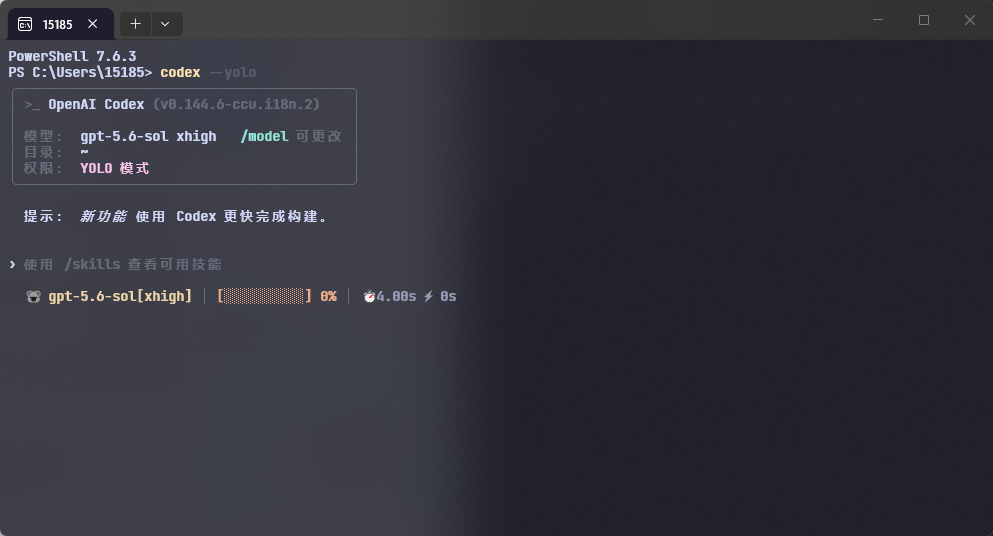
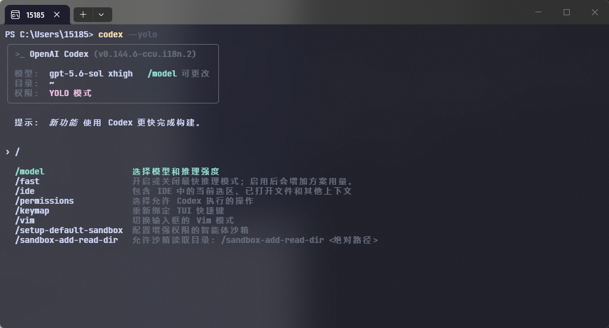
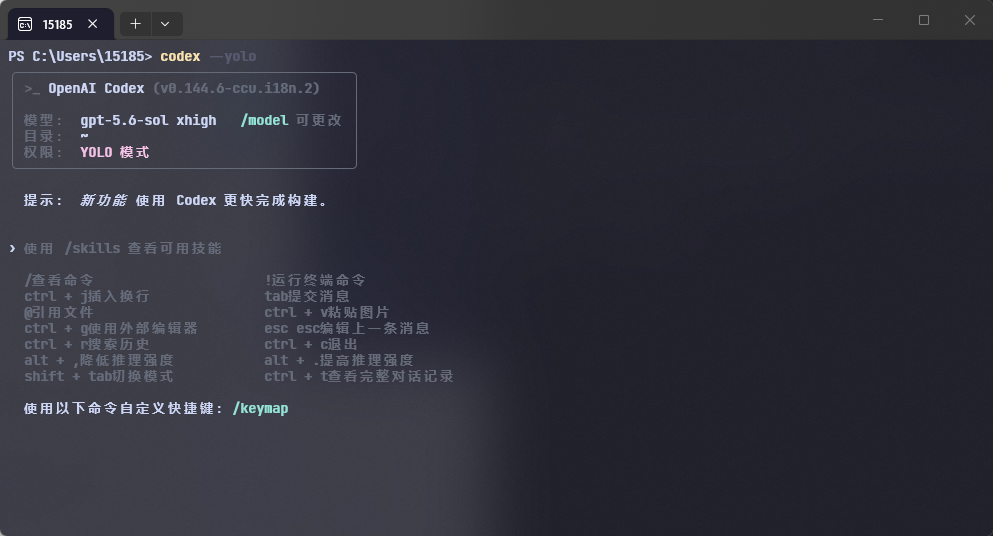
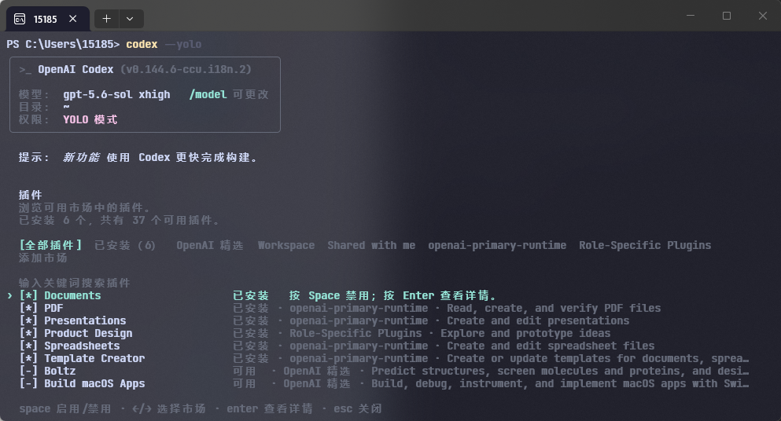
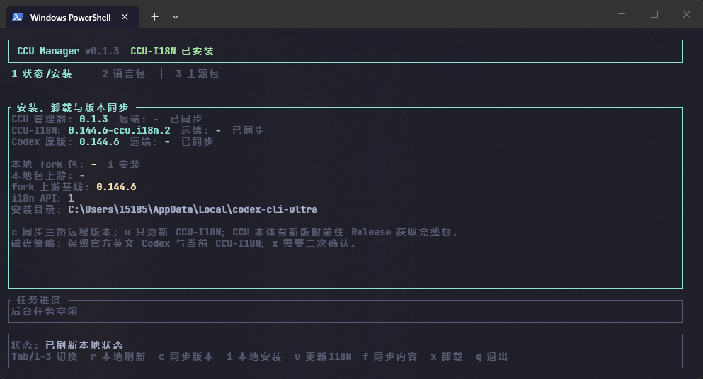

# Codex-Cli-Ultra

**中文** · [English](README.en.md)

[](https://github.com/Cec1c/codex-cli-ultra/releases/latest)

[](LICENSE)

Codex-Cli-Ultra（CCU）为 Codex CLI 提供外部 FTL 语言包、Windows 安装管理和可选的界面扩展。当前参考实现为简体中文。

[最新 Release](https://github.com/Cec1c/codex-cli-ultra/releases/latest) · [贡献指南](CONTRIBUTING.md) · [Codex i18n fork](https://github.com/Cec1c/codex)

## 项目目标

- **本地化：** 建立稳定的 i18n 接口，让每种语言以独立 FTL 包维护。翻译缺失或校验失败时，Codex 按消息回退到内置英文。
- **界面扩展：** 在不影响基础功能的前提下探索状态栏、主题和其他终端界面配置。所有个性化功能均为可选项。
- **版本管理：** 管理官方 Codex、CCU-I18N fork 与 CCU 本体的安装、更新、卸载和版本状态。

## 效果演示

当前截图使用简体中文语言包。其他语言可基于 [英文模板](templates/languages/messages.en-US.ftl) 开发，具体流程见 [贡献指南](CONTRIBUTING.md)。

截图中的终端背景、字体和配色来自独立的终端配置；CCU 负责图中 Codex 界面的本地化和可选状态栏。

<table>
  <tr>
    <td width="50%"><strong>启动首页</strong><br></td>
    <td width="50%"><strong>斜杠命令</strong><br></td>
  </tr>
  <tr>
    <td width="50%"><strong>帮助页面</strong><br></td>
    <td width="50%"><strong>二级页面</strong><br></td>
  </tr>
</table>

## 安装与卸载

### 环境要求

- Windows x64
- PowerShell 7
- Node.js 24 或更高版本
- 通过 npm 安装的官方 Codex

```powershell
npm install -g @openai/codex
```

### Release 安装（推荐）

1. 从 [Releases](https://github.com/Cec1c/codex-cli-ultra/releases/latest) 下载 `codex-cli-ultra-v*-windows-x64.zip` 和对应的 `.sha256`。
2. 校验 SHA256 并解压 ZIP。
3. 运行 `install.cmd`。
4. 打开新终端并验证：

```powershell
codex --version
codex --i18n-self-check
codex --yolo
```

Release ZIP 已内置经过 manifest、文件大小和 SHA256 校验的 fork 二进制。

卸载 CCU 并恢复官方英文版：

```powershell
codex-ultra uninstall
# 或运行 Release 包中的 uninstall.cmd
```

### 我非要源码安装

源码安装还需要 Rust 工具链：

```powershell
git clone https://github.com/Cec1c/codex-cli-ultra.git
cd codex-cli-ultra
npm ci
.\install.ps1
```

本仓库只编译 CCU 管理器，不编译完整的 Codex Rust 项目。运行 CCU-I18N 仍需要符合发布 manifest 的 fork 二进制。

安装器按以下顺序查找 fork Release：

1. `-ForkReleaseDir` 指定的目录；
2. 仓库根目录的 `fork-release/`；
3. [`Cec1c/codex` Releases](https://github.com/Cec1c/codex/releases) 中的最新稳定版本。

需要自行编译 fork 时，请使用 [`Cec1c/codex`](https://github.com/Cec1c/codex) 仓库。

## CCU Manager

`ccu-manager` 是 CCU 的 Ratatui 管理界面，用于检查版本、安装本地 fork Release、更新 CCU-I18N、同步内容和卸载。网络与文件任务在后台线程执行。

<p align="center">
  
</p>

| 按键 | 操作 |
| --- | --- |
| `r` | 刷新本地状态 |
| `c` | 查询 CCU、CCU-I18N 和 OpenAI Codex 的远程版本 |
| `i` | 安装检测到的本地 fork Release |
| `u` | 更新 CCU-I18N |
| `f` | 同步语言包和主题 |
| `x` | 二次确认卸载 |
| `q` | 退出 |

## 工作原理

项目分为三个版本通道：

| 组件 | 仓库 | 职责 |
| --- | --- | --- |
| OpenAI Codex | [`openai/codex`](https://github.com/openai/codex) | 官方上游稳定版本 |
| CCU-I18N fork | [`Cec1c/codex`](https://github.com/Cec1c/codex) | Rust/TUI i18n 接口、`/language`、英文回退和编译后的 Codex 二进制 |
| CCU | 本仓库 | 语言包、主题、安装器、管理 TUI、版本同步和 Release 分发 |

```text
OpenAI Codex stable tag
          │
          ▼
CCU-I18N fork ── i18n API + built-in English fallback
          │
          ├── external FTL language packs
          ▼
CCU manager ── install / update / uninstall / sync
```

安装后保留官方 npm Codex 作为英文回退版本。CCU 启动器根据已校验的安装状态选择当前 fork；本地状态无效时回退到官方二进制。

是的，这么追着codex的更新其实很累很低效，但相关维护人员暂时并没有理会我的关于添加i18n接口的issues，尽管我当时提交了一版示范

## 项目结构

```text
codex-cli-ultra/
├── .github/workflows/       # CI、Release 和 fork 通道同步
├── docs/                    # 设计、发布合同和项目进度文档
├── packages/
│   ├── languages/zh-CN/     # 简体中文语言包
│   └── themes/ccu-hermes/   # Hermes 状态栏主题
├── release-channels/
│   └── stable.json          # 当前稳定 fork Release 元数据
├── research/                # Codex 可见文本目录与版本调查结果
├── scripts/                 # 构建、审计、打包和同步脚本
├── src/
│   ├── content/             # 语言包与主题内容同步
│   ├── discovery/           # 官方 npm Codex 发现
│   ├── installer/           # 安装、更新、回滚与卸载
│   ├── language/            # FTL 语言包校验
│   ├── launcher/            # 官方版与 fork 的运行时选择
│   ├── release/             # GitHub Release、manifest 和下载校验
│   ├── state/               # 本地安装状态
│   ├── theme/               # 主题包校验与应用
│   └── manage-main.mjs      # codex-ultra 管理命令入口
├── templates/languages/     # 英文 FTL 模板
├── test/                    # Node.js 测试
├── tui/                     # Rust Ratatui 管理器
├── install.ps1 / install.cmd
└── uninstall.ps1 / uninstall.cmd
```

`dist/`、`tui/target/` 和 `artifacts/` 为构建产物，不是语言包或主题的维护入口。

## 语言包格式

每个语言包包含 manifest 和 FTL 资源：

```text
packages/languages/<locale>/
├── manifest.json
└── messages.ftl
```

```ftl
status-line-configure-title = 配置状态栏
status-line-save-failed = 保存状态栏设置失败：{ $error }
```

基本要求：

- 消息键和 Fluent 变量与 [英文模板](templates/languages/messages.en-US.ftl) 一致；
- manifest 声明 locale、显示名称、许可证、i18n API 范围和资源 SHA256；
- 不完整或无效的消息由运行时回退到内置英文。

校验命令：

```powershell
node src/cli.mjs language validate `
  --pack packages/languages/<locale> `
  --catalog research/codex-0.144.5/tui-messages.jsonl `
  --template templates/languages/messages.en-US.ftl
```

## 版本体系与同步

| 通道 | 当前版本示例 | 更新条件 |
| --- | --- | --- |
| CCU | `v0.1.3` | 安装器、管理器、内容包或文档发生变化 |
| CCU-I18N fork | `0.144.6-ccu.i18n.2` | Codex 源码或 i18n 接口发生变化 |
| OpenAI Codex | `0.144.6` | 官方发布新的稳定版本 |

自动化每 6 小时检查上游稳定 Release。CCU 的独立更新不会触发 fork 重新编译；只有 fork 代码需要变化时才创建新的 fork Release。

## 当前状态

| 项目 | 状态 |
| --- | --- |
| 支持平台 | Windows x64 |
| CCU | `v0.1.3` |
| CCU-I18N | `0.144.6-ccu.i18n.2` |
| 参考语言包 | 简体中文 `zh-CN` |
| FTL 覆盖 | 1,396 个实际使用的消息键 |
| 回退机制 | 按消息回退到内置英文 |
| 个性化 | 可选 Hermes 状态栏；其他主题能力仍在开发中 |

Mac 和 Linux也许以后会做，主要是我手上没有Mac

## 贡献指南

欢迎提交新的语言包、翻译修正、兼容性报告和界面扩展。其他语言的贡献者可直接使用英文模板、英文 Issue 和英文 Pull Request，不需要了解中文语言包。

详见 [CONTRIBUTING.md](CONTRIBUTING.md)。

## 许可证

本项目使用 [GNU General Public License v3.0](LICENSE)。语言包需在 manifest 中单独声明许可证。

## 非官方说明

Codex-Cli-Ultra 是非官方社区项目，与 OpenAI 不存在隶属、赞助或背书关系。Codex 和 OpenAI 是其各自权利人的名称或商标。
